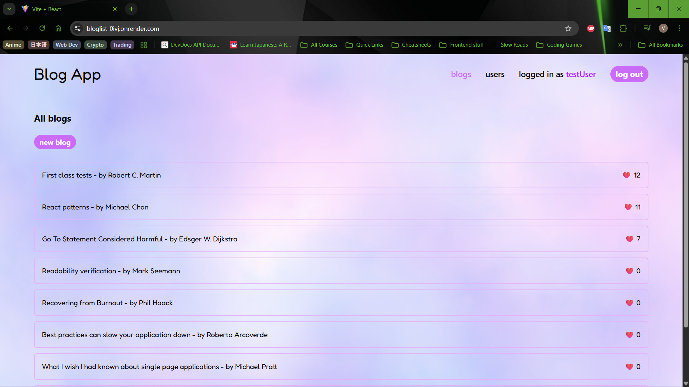
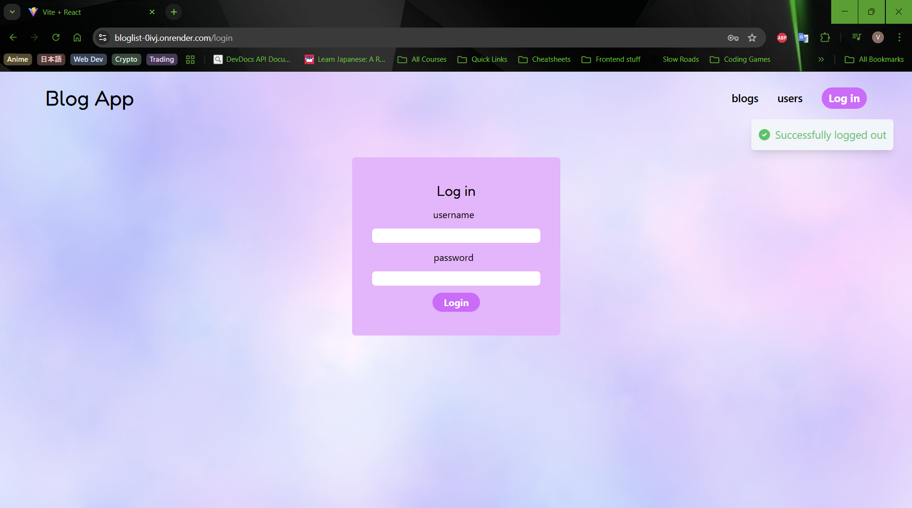
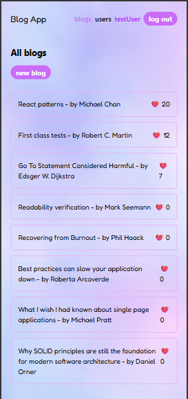

# Blog List App 📝

Welcome to the Blog List App! 🚀 This is a full-stack MERN application that allows users to share and discuss their favorite blogs.

While the app itself has a simple and focused feature set (user auth, blog management, comments, and likes), its main purpose was to serve as a deep dive into **advanced testing and DevOps principles**. The frontend was intentionally kept straightforward to put the spotlight on creating a robust, automated, and thoroughly tested application pipeline. The project may be updated with more features in the future!

## ✨ Features

* **User Authentication:** 🔐 Secure user registration and login with JWT-based authentication.
* **Blog Management:** ✍️ Create, read, update, and delete blog posts.
* **Liking System:** ❤️ Users can like their favorite blogs.
* **Commenting:** 💬 Users can leave comments on blog posts.
* **Responsive Design:** 📱 The application looks great on all screen sizes.

## 📸 Screenshots
### Homepage


### Login Page


### Mobile Version


---

## 🛠️ Tech Stack

### Frontend

* **React:** For building the user interface.
* **Vite:** A blazing-fast build tool.
* **Tailwind CSS:** A utility-first CSS framework for rapid UI development.
* **React Router:** For handling client-side routing.
* **React Query:** For powerful data fetching, caching, and state management.

### Backend

* **Node.js:** A JavaScript runtime for the server-side.
* **Express:** A minimal and flexible web application framework.
* **MongoDB:** A NoSQL database for storing application data.
* **Mongoose:** An ODM library for MongoDB and Node.js.
* **JWT (JSON Web Tokens):** For secure user authentication.

### Testing

* **Vitest:** ✅ For frontend unit and integration testing.
* **Supertest:** 🧪 For backend API testing.
* **Playwright:** 🎭 For end-to-end testing across real browsers.

### DevOps

* **GitHub Actions:** 🤖 For continuous integration and continuous deployment (CI/CD).
* **Render:** ☁️ For hosting the deployed application.

---

## 🔄 CI/CD Pipeline

This project uses GitHub Actions for a complete CI/CD workflow. You can find the pipeline definitions in `.github/workflows/pipeline.yml` and `.github/workflows/playwright.yml`.

The pipeline includes the following stages:

1.  **Test and Build:** 🏗️
    * Installs dependencies.
    * Runs linting checks.
    * Runs frontend and backend tests.
    * Builds the frontend application.
2.  **End-to-End Testing:** 🚦
    * Runs Playwright tests to ensure the application works as expected from a user's perspective.
3.  **Deployment:** 🚀
    * Automatically deploys the application to Render on every push to the `main` branch.

---

## 🚀 Getting Started

### Prerequisites

* Node.js (v20.x or later)
* npm
* MongoDB

### Installation

1.  **Clone the repository:**

    ```bash
    git clone [https://github.com/vikram42003/Blog-List.git](https://github.com/vikram42003/Blog-List.git)
    cd Blog-List-App
    ```

2.  **Install dependencies:**

    ```bash
    npm install
    ```

3.  **Set up environment variables:**

    Create a `.env` file in the root directory and add the following variables:

    ```
    MONGODB_URL=<your_mongodb_url>
    SECRET=<your_jwt_secret>
    PORT=3003
    ```

### Running the Application

1.  **Start the backend server:**

    ```bash
    npm run dev
    ```

2.  **In a new terminal, start the frontend development server:**

    ```bash
    npm run dev --workspace=frontend
    ```

The application will be available at `http://localhost:5173`.

---

## 🔬 Testing

* **Run all tests:**

    ```bash
    npm test
    ```

* **Run frontend tests:**

    ```bash
    npm run test:frontend
    ```

* **Run backend tests:**

    ```bash
    npm run test:backend
    ```

* **Run end-to-end tests:**

    ```bash
    npm run test:e2e
    ```